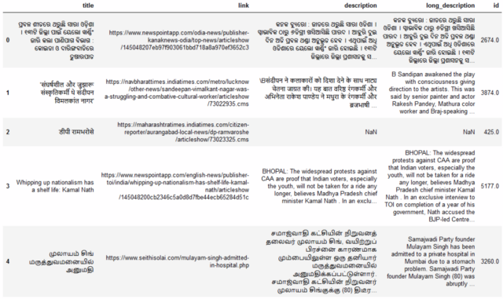
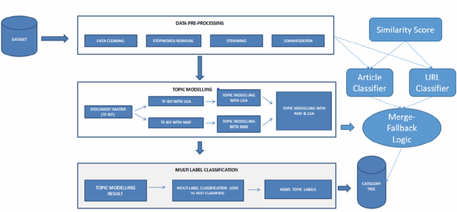
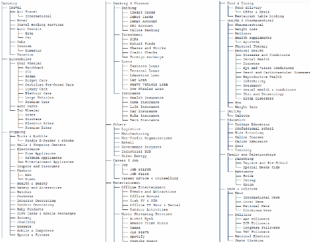
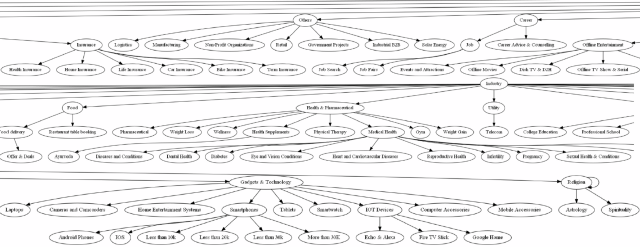

# Topic Modelling into a Category Tree

_Numerical combination of LDA and NMF cascaded with W2V to categorize 1M+ multi-lingual records into a 275-node, 5-level deep category tree._

- _This solution ranked 4th out of 10,000+ in an All-India AI Hackathon, Automated Multi Label Classification, in Code Gladiators 2020 organized by Techgig._

# How to run?

1) Download the **Google pre-trained model** using wget:
wget -c "https://s3.amazonaws.com/dl4j-distribution/GoogleNews-vectors-negative300.bin.gz"

2) **Download the input files** from here:
https://drive.google.com/drive/folders/1K07Ax1Q6Aj4q_Hkh1vUnM61oZ_kNPd0r?usp=sharing

3) **Multi-Lingual Category Tree Classification.ipynb is the main file** to be executed. LDA-NMF Combination Classifier.ipynb is the fallback LDA-NMF implementation. It is already executed for the given input dataset. If you want to categorize another dataset execute this file also.

- _Note: Please remember to manually tag the topics from the words clustered after running LDA and NMF. Only then the output category will make sense._

**The Hackathon challenge was to multi-categorize 1M+ multi-lingual articles with meta-information, at high precision. The meta-information denotes the category-tree information hidden in the URL text sequence and also the title of each article. You can get a glance at the input data-set below.**

The above articles are to be categorized into a category hierarchy based on the article topic. For instance, "Modi visits to China" are to be categorized in "Politics^International" while "Corona tally reached record high" as "Health^Pandemic".

We need to do Topic Modelling as the input articles are not labelled, prior. **But Topic Modelling won't guarantee accurate results, though it is quick,** as no training is required. 
**Hence, we need alternate categorization approaches and arrange them as cascaded fallback**, while also improving upon Topic Modelling results.

# Cascaded Fallback Pipeline
1. **Main Approach: Category Tree Classifier using Description**
**Correlate word vectors of the words present in node categories & article description, computed using Google Word2Vec Model.** This model is pre-trained on Google News data-set, which is similar to the input data we need to categorize. 

2. **Fallback 1: URL based Category Tree Classifier**
The **sequence of folders, from left to right embodies the category hierarchy** associated with the article. For instance, the below URL should be categorized as "News/Politics/BJP Politics". If the confidence value of "Approach 1" falls below a threshold, then Fallback 1 is triggered.
https://www.navjivanindia.com/news/bjp-leader-kaushal-kishore-attacks-up-police-over-law-and-order-in-up

3. **Fallback 2: LDA-NMF Combination Model**
Latent Dirichlet Allocation (LDA) is a classic solution to Topic-Modelling. But in practice, it gave huge proportion of wrong classifications. Hence, Non Negative Matrix Factorization (NMF) is also used and numerically combined with LDA, along with Multi Class Binarizer to refine the results.

4. **Fallback 3: Category Tree Classifier using Description**
If all the above approaches fail, then you can either **mark the article as "unclassified"** or take output of "Main Approach" as the final fallback.
You can also **checkout "Improvements" head** at the bottom of this blog, for further fallback strategies to replace Fallback 4.

# Constructing Category Tree
The category tree to classify the documents are given as csv file below.

## Main Logic: Category Tree Classn using Description

Firstly, we correlate words in 'long description' with nodes to find category.

**A deep algorithm which peruses GoogleNews vectors of category tree nodes correlated with each word in article description was implemented. Multi-word categories are intelligently handled not to hike up the similarity scores. This function is the core of the solution.**

**Breadth-First Correlation Traversal of category tree is done** to find out the best category tree allocation based on Word2Vec similarity.

To combine the outcome of different algorithms, we need to compute the classification confidence for each article. Hence, **saved the (id, tree, confidence) information into CSV file.**

The **confidence score is computed using a mathematical formula based on the numerical distribution of values** in the list. The formula computes the difference between highest similarity  value and second highest value, as it denotes ambiguity when the top 2 values are near.

### Tweaking Category Tree
Multi-words categories having words of different meanings are combined into similar meaning words so that word vector distance metrics won't go awry. For instance, "Education" was found similar to "Finance" among word vectors, hence renamed to a similar meaning word, "Schooling".

## Fallback 1: URL based Category Tree Classifier

No single information may be enough to properly classify an article. First, **we use the tree information embedded in the URL links to find the category.**

## Fallback 2: LDA-NMF Combination Model
**LDA is a probabilistic generative process, while NMF is a linear-algebraic method** to compute the value of keywords in the documents so that each document can be assigned to a topic, with maximum value. However, neither LDA nor NMF could return good results individually, being unsupervised.

**Hence, a numerical combination of LDA and NMF output matrices post-normalization was implemented to figure out the maximum probable topic.**

**After doing pre-processing, apply CountVectorizer and TF-IDF-Vectorizer on 'article description' to compute the document-term matrix (DTM) to be fed in to LDA and NMF respectively.**

Manually label the topics based on the top 20 words in each cluster.

- Output of LDA is a matrix of size # of articles * # of topics. Each cell contains the probability of an article belonging to a topic. 
We can also use NMF to decompose DTM into two matrices, like below, which is conceptually similar to LDA model, except that here we use linear algebra instead of probabilistic model.

- Output of NMF is also a matrix of size # of articles * # of topics and interpretation remains the same. Hence, we can combine the output matrices of LDA and NMF on y-axis to get 1 million * 40 columns. (Input = 1M rows. Topics = 20 each for LDA and NMF)

Take the argmax() of each row to find the most probable prediction out of both LDA and NMF

_Note: Remember to do normalization before matrix concatenation._

The only downside is that **this results in 1st level categorization and not tree hierarchy.** So is the reason, I have decided to place it as 2nd Fallback.  

**Ideally, Hierarchical-LDA should be done and be placed as 1st Fallback after Article Classifier in the solution pipeline.** Article Classifier should still be the main logic, as Hierarchical-LDA produces word clusters of random categories which may not be same as the category tree we want. 

## Merging Description, URL & LDA-NMF Classifiers

The article description classifier and URL classifier are merged into a pipeline with LDA-NMF combination model, as cascading fall backs based on the corresponding confidence scores. 
Much weightage is given to description classifier as LDA-NMF gives only the category (not category tree) and URL often doesn't contain the required info. If all 3 methods failed then mark it as "unclassified" or use outcome of article classifier, though ambiguous.

_Disclaimer: As the above solution is coded in a 24-hour Hackathon, the code may not be perfect. It can be improved upon using 2 approaches noted below and also hyper-parameters in the code are required to be tuned more._

## Improvements
1. **h-LDA: Hierarchical-LDA to group documents by hierarchies of topics** and combine with LDA-NMF output.

2. **Knowledge Graph:** Knowledge graph of article text would generate hierarchical relation of words, akin to a category tree. This information can be used to map article to category tree.

If you have any query or suggestion, you can reach me here: https://www.linkedin.com/in/ananduthaman/